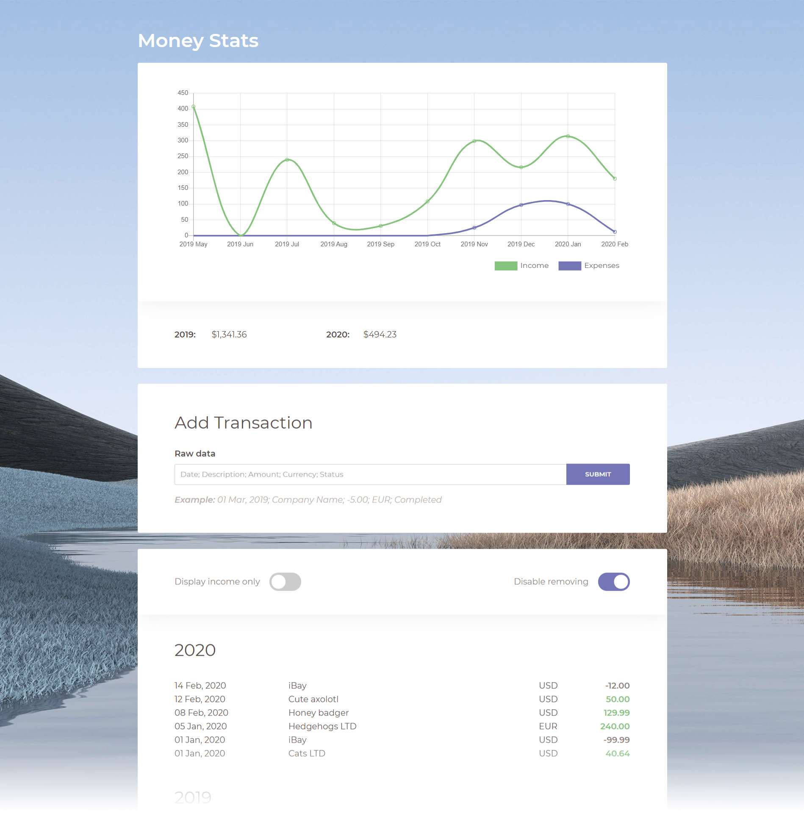

# Money Stats

This app can help you to track your income and expenses.

## Installation

- Download `build.zip` from [Latest Releases](https://github.com/maestro9/moneystats/releases)
- Unpack the ZIP file anywhere. Done!

## Setting Up A Database

The app stores it's data in a Firebase database. You will need to create **free Firebase account** and setup your own database:

- Add new project in Firebase [console](https://console.firebase.google.com/)
- Create a new "[Cloud Firestore](https://firebase.google.com/products/firestore/)" database
- Create a new collection. Call it `mdata`
- Create your first document (you can delete it later). For example:
	- **Field** / **Type** / **Value**
	- date / *string* / 01 Mar, 2019
	- description / *string* / Test
	- amount / *string* / 50.00
	- currency / *string* / USD
	- status / *string* / Completed
	- comment / *string* / Test
	- **Note: The fields names above must be in lower case**
- Setup access rules:
	- On the database "Rules" tab replace the
	- `allow read, write: if false;` line with
	- `allow read, write: if request.auth.uid != null;`
	- It will allow any registered user to view and edit the database
- Enable email/password authentication
- Create a new user
- Create new app (Settings → General → Your apps → Web app)
- Сopy settings from `firebaseConfig` object to `settings.js` in the app folder
- Register on [exchangeratesapi.io](https://exchangeratesapi.io) and get API key
- Paste the key to `settings.js`

### If you have transactions in currencies different from USD

All the statistic calculations are made in USD dollars. When you add a new transaction and it's currency is different from USD the app will automatically convert it to USD using exchange rates of the day when the transaction was made and will save it to the database.

If your currency is not supported by the app, you will have to enter the converted amount manually after the status. For example: `01 Mar, 2019; Company Name; -500.00; UAH; Completed; -18.60` where 18.60 is 500 UAH converted to USD. If you will not do it the transaction will not be calculated and used in the Statictics section of the app.

**List of supported for automatic conversion currencies**: CAD, HKD, ISK, PHP, DKK, HUF, CZK, GBP, RON, SEK, IDR, INR, BRL, RUB, HRK, JPY, THB, CHF, EUR, MYR, BGN, TRY, CNY, NOK, NZD, ZAR, USD, MXN, SGD, AUD, ILS, KRW, PLN.

---

# For Developers

Built using React, Chart.js, Firebase, Moment.js

## Building The App

Before continuing make sure you have Node, NPM, Yarn, Gulp and Git installed.

- Clone the repo using `git clone git@github.com:maestro9/moneystats.git`
- In project folder install dependencies using `yarn install`
- Build the app using `yarn build` or run it in development mode with `yarn start`

## Available Scripts

In the project directory, you can run:

### `yarn start`

Runs the app in the development mode. 
Open [http://localhost:3000](http://localhost:3000) to view it in the browser.

The page will reload if you make edits. 
You will also see any lint errors in the console.

### `yarn test`

Launches the test runner in the interactive watch mode. 
See the section about [running tests](https://facebook.github.io/create-react-app/docs/running-tests) for more information.

### `yarn build`

Builds the app for production to the `build` folder. 
It correctly bundles React in production mode and optimizes the build for the best performance.

The build is minified and the filenames include the hashes. 
Your app is ready to be deployed!

See the section about [deployment](https://facebook.github.io/create-react-app/docs/deployment) for more information.

### `yarn eject`

**Note: this is a one-way operation. Once you `eject`, you can’t go back!**

If you aren’t satisfied with the build tool and configuration choices, you can `eject` at any time. This command will remove the single build dependency from your project.

Instead, it will copy all the configuration files and the transitive dependencies (Webpack, Babel, ESLint, etc) right into your project so you have full control over them. All of the commands except `eject` will still work, but they will point to the copied scripts so you can tweak them. At this point you’re on your own.

You don’t have to ever use `eject`. The curated feature set is suitable for small and middle deployments, and you shouldn’t feel obligated to use this feature. However we understand that this tool wouldn’t be useful if you couldn’t customize it when you are ready for it.

## Useful links

- Firebase:
	- [Get Data](https://firebase.google.com/docs/firestore/query-data/get-data)
	- [Add Data](https://firebase.google.com/docs/firestore/manage-data/add-data)
	- [Remove Data](https://firebase.google.com/docs/firestore/manage-data/delete-data)
- [Chart.js](https://www.chartjs.org/docs/):
- [React Chart.js](https://github.com/jerairrest/react-chartjs-2)
- [Moment.js](https://momentjs.com/)
- [exchangeratesapi.io](https://exchangeratesapi.io/)
- [React-Toastify](https://github.com/fkhadra/react-toastify)

## Learn More About React

- [React documentation](https://reactjs.org/)
- [Code Splitting](https://facebook.github.io/create-react-app/docs/code-splitting)
- [Analyzing the Bundle Size](https://facebook.github.io/create-react-app/docs/analyzing-the-bundle-size)
- [Making a Progressive Web App](https://facebook.github.io/create-react-app/docs/making-a-progressive-web-app)
- [Advanced Configuration](https://facebook.github.io/create-react-app/docs/advanced-configuration)
- [Deployment](https://facebook.github.io/create-react-app/docs/deployment)
- `yarn build` [fails to minify](https://facebook.github.io/create-react-app/docs/troubleshooting#npm-run-build-fails-to-minify)
